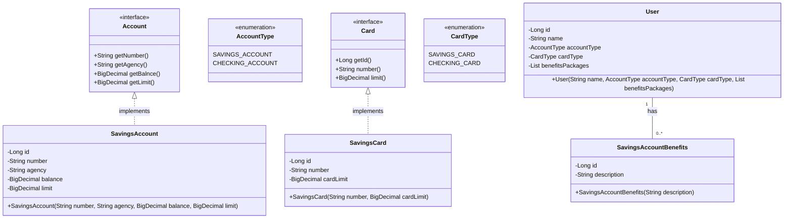

# desafio-api-santander-dio
## Abstração e implementação de uma parte de um sistema bancário
- Inspirado na Santander Dev Week 2023, modifiquei um pouco as abstações e ideias.
- Dei mais ênfase na asbtração e orientação a objetos deixando de um jeito mais que abrange novas implementações.

    
